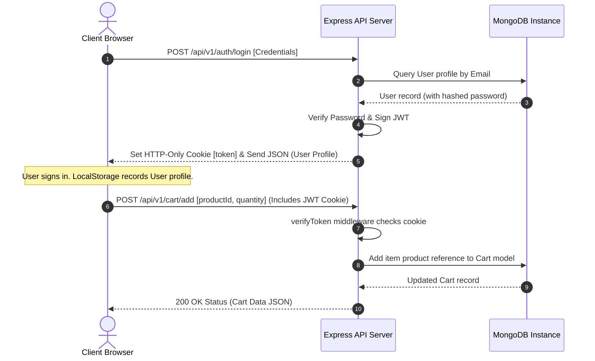
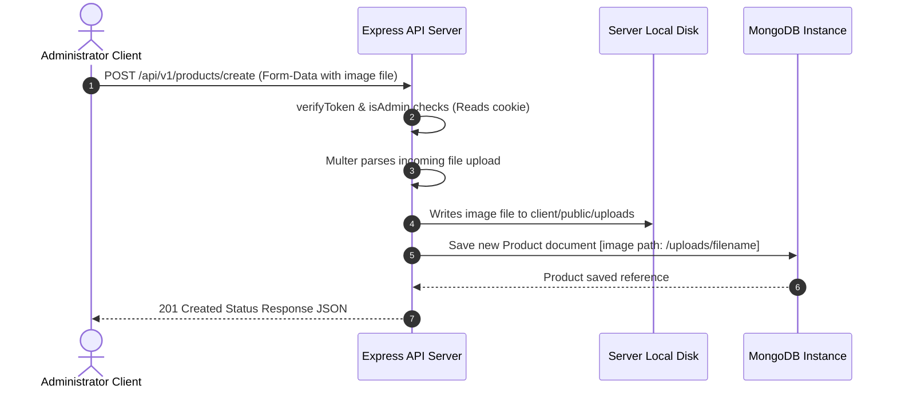

# Merchant Hub — Premium Workstation & Creator Hardware E-Commerce Platform

```text
███╗   ███╗███████╗██████╗  ██████╗██╗  ██╗ █████╗ ███╗   ██╗████████╗    ██╗  ██╗██╗   ██╗██████╗ 
████╗ ████║██╔════╝██╔══██╗██╔════╝██║  ██║██╔══██╗████╗  ██║╚══██╔══╝    ██║  ██║██║   ██║██╔══██╗
██╔████╔██║█████╗  ██████╔╝██║     ███████║███████║██╔██╗ ██║   ██║       ███████║██║   ██║██████╔╝
██║╚██╔╝██║██╔══╝  ██╔══██╗██║     ██╔══██║██╔══██║██║╚██╗██║   ██║       ██╔══██║██║   ██║██╔══██╗
██║ ╚═╝ ██║███████╗██║  ██║╚██████╗██║  ██║██║  ██║██║ ╚████║   ██║       ██║  ██║╚██████╔╝██████╔╝
╚═╝     ╚═╝╚══════╝╚═╝  ╚═╝ ╚═════╝╚═╝  ╚═╝╚═╝  ╚═╝╚═╝  ╚═══╝   ╚═╝       ╚═╝  ╚═╝ ╚═════╝ ╚═════╝ 
```

An exhaustive, high-performance workstation hardware, productivity tools, and creator setup storefront. Built with an Express/Node backend, MongoDB/Mongoose database models, and a modern React 19 frontend compiled using Vite, stylized with an elegant flat dark HSL design system.

---

## Table of Contents

1. [Project Overview & Philosophy](#1-project-overview--philosophy)
2. [Key System Features](#2-key-system-features)
3. [Technology Stack](#3-technology-stack)
4. [Architecture & Folder Structure](#4-architecture--folder-structure)
5. [Database Models & Schema Design](#5-database-models--schema-design)
6. [API Endpoint Documentation](#6-api-endpoint-documentation)
7. [Design System & UI Component Spec](#7-design-system--ui-component-spec)
8. [Installation & Local Setup Guide](#8-installation--local-setup-guide)
9. [Database Seeding & Administration](#9-database-seeding-and-administration)
10. [Client API Integration Details](#10-client-api-integration-details)
11. [System Workflows & Diagrams](#11-system-workflows--diagrams)
12. [Security Best Practices](#12-security-best-practices)
13. [Troubleshooting Guide](#13-troubleshooting-guide)
14. [Contributing Guidelines](#14-contributing-guidelines)
15. [License](#15-license)

---

## 1. Project Overview & Philosophy

**Merchant Hub** is custom-engineered for modern builders, coders, designers, and hardware enthusiasts. The application focuses on showcasing high-end mechanical keyboards, audio gear, navigation gear, and desk accessories under a refined, distraction-free environment.

### Design Principles:
- **Jakob's Law Compliance**: Standard e-commerce conventions are strictly applied. Users instantly feel familiar with the catalog controls, navigation bar, shopping cart columns, and checkout workflows.
- **Flat Visual Design**: Replaces distracting visual noise (radial gradient overlays, high-opacity glowing rings, absolute background mesh overlays, dynamic card borders) with clean, high-contrast slate colors (`bg-slate-950`), clear outlines (`border-slate-900`), and typography-first hierarchies.
- **Responsive Fluidity**: Full container fluid grids ensure absolute visual scaling from a 320px mobile viewport up to massive ultrawide monitors.
- **Zero Placeholders**: Every asset, layout element, and copy text represents true-to-life content with high-resolution imagery and precise currency metrics.

---

## 2. Key System Features

### User Experience (Frontend):
- **Dynamic Catalog Page**: A fully searchable catalog grid that supports instantaneous client-side keyword searching across titles/descriptions and price sorting.
- **Minimalist Cart Page**: A streamlined list layout highlighting essential product parameters, fluid quantity adjustments, instant deletion, subtotal calculations, and checkout simulation.
- **Interactive Checkout Mock**: Allows users to simulate immediate ordering without bloated checkout pipelines.
- **Product Creation Dashboard**: Accessible exclusively by administrators to register new hardware items, upload high-resolution images via a multipart form, define price tags, and configure specifications.
- **Auth Guard Integration**: Automatically catches unauthorized errors at the API request level and programmatically guides users to log in before making state modifications.

### Server Infrastructure (Backend):
- **Stateful JWT Auth**: Employs secure, HTTP-only cookie tokens for tracking and verifying user sessions.
- **Multer Middleware Setup**: Standardized disk storage pipelines for catalog images, resolving uploads, and statically rendering static content folders.
- **Payload Validation**: Strict request interceptors validate properties such as string lengths, pricing thresholds, and formats before executing database updates.
- **MongoDB Persistence**: Mongoose schemas manage records for Users, Products, and Cart lists, ensuring relational updates cascades safely.

---

## 3. Technology Stack

### Frontend Components:
- **Core Library**: React 19.2.6 (using modern Hooks like `useState`, `useEffect`, and custom component bindings).
- **Tooling/Compiler**: Vite 8.0.12 (hot module reloading, fast build processes).
- **Styling**: Tailwind CSS v4.3.0 & PostCSS.
- **Routing**: React Router DOM v7.17.0 (with structured layout route management).
- **API Client**: Axios 1.17.0 (integrated interceptors for unauthorized redirects).
- **Icons**: Lucide React v1.17.0.

### Backend Components:
- **Application Engine**: Node.js & Express v4.21.2.
- **Database Engine**: MongoDB.
- **ODM Layer**: Mongoose v8.9.2.
- **File Uploding Middleware**: Multer v1.4.5-lts.1.
- **Security & Tokens**: bcryptjs v2.4.3 & jsonwebtoken v9.0.2.
- **Validation**: express-validator v7.2.1.
- **CORS Setup**: cors v2.8.5.
- **Server Restart Daemon**: nodemon v3.1.14.

---

## 4. Architecture & Folder Structure

```text
merchant-hub/
│
├── client/                     # Frontend Application React Code
│   ├── public/                 # Static Assets (Images, Logos, Mockups)
│   │   └── workspace_hero.png  # Hero display desktop wallpaper
│   ├── src/
│   │   ├── api/
│   │   │   └── axios.js        # Global Axios Client Instance Configuration
│   │   ├── components/
│   │   │   ├── CTASection.jsx  # Newsletter layout block
│   │   │   ├── FeaturedEquipment.jsx # Best-selling product showcases
│   │   │   ├── Footer.jsx      # Minimal bottom brand component
│   │   │   ├── HeroSection.jsx # Split landing layout component
│   │   │   ├── HubModules.jsx  # Shop by category card modules
│   │   │   ├── HubStats.jsx    # Metric highlights segment
│   │   │   ├── Navbar.jsx      # Central header navigation control
│   │   │   ├── ProductCard.jsx # Grid card item with add/delete triggers
│   │   │   └── Products.jsx    # Catalog controller with search/sort toolbar
│   │   ├── pages/
│   │   │   ├── CartPage.jsx    # Streamlined shopping cart review page
│   │   │   ├── CreateProductPage.jsx # Multipart administrative upload form
│   │   │   ├── HomePage.jsx    # Landing landing page setup
│   │   │   ├── LoginPage.jsx   # Account credentials forms
│   │   │   └── RegisterPage.jsx # Account registration forms
│   │   ├── routes/
│   │   │   └── AppRoutes.jsx   # Client path mappings
│   │   ├── App.jsx             # React Entrypoint layout wrapping paths
│   │   ├── index.css           # Global custom Tailwind CSS directive definitions
│   │   └── main.jsx            # DOM Node Mounting file
│   ├── package.json            # Client build configurations & libraries
│   └── vite.config.js          # Vite configurations
│
└── server/                     # Backend API Node Code
    ├── config/
    │   └── connectdb.js        # Mongoose MongoDB Connection handlers
    ├── controllers/
    │   ├── authControllers.js  # Account signup, signin, and session controls
    │   ├── cartControllers.js  # Cart aggregation, insertion, and subtraction controls
    │   └── productController.js# Product creation, listing, and deletion controllers
    ├── middlewares/
    │   ├── authMiddleware.js   # JWT verification middleware
    │   └── uploadMiddleware.js # Multer disk storage and file filter parameters
    ├── models/
    │   ├── cartModel.js        # Mongoose Schema mapping user items
    │   ├── productModel.js     # Mongoose Schema mapping product info
    │   └── userModel.js        # Mongoose Schema mapping account profiles
    ├── routes/
    │   ├── authRoutes.js       # Auth paths mapping
    │   ├── cartRoutes.js       # Cart interaction paths mapping
    │   ├── productRoutes.js    # Product listing/creation paths mapping
    │   └── uploadRoutes.js     # Multipart media upload routes
    ├── validations/
    │   ├── authValidations.js  # Registration data rules
    │   ├── cartValidation.js   # Quantity validation constraints
    │   └── productValidations.js # Price and specs validation schema constraints
    ├── .env                    # System Environment parameters (Excluded from GIT)
    ├── package.json            # Server commands script definitions
    ├── seedAdmin.js            # Admin account instantiation tool
    └── server.js               # Main server entrypoint file
```

---

## 5. Database Models & Schema Design

The Mongoose configuration specifies strict type checking, default definitions, and relational referencing for users, products, and shopping lists.

### 5.1 User Model (`server/models/userModel.js`)
```javascript
const userSchema = new mongoose.Schema({
  username: {
    type: String,
    required: [true, "Username is required"],
    trim: true,
    minlength: [3, "Username must be at least 3 characters"]
  },
  email: {
    type: String,
    required: [true, "Email is required"],
    unique: true,
    trim: true,
    lowercase: true,
    match: [/^\w+([\.-]?\w+)*@\w+([\.-]?\w+)*(\.\w{2,3})+$/, "Please fill a valid email address"]
  },
  password: {
    type: String,
    required: [true, "Password is required"],
    minlength: [6, "Password must be at least 6 characters"]
  },
  role: {
    type: String,
    enum: ["user", "admin"],
    default: "user"
  }
}, { timestamps: true });
```

### 5.2 Product Model (`server/models/productModel.js`)
```javascript
const productSchema = new mongoose.Schema({
  name: {
    type: String,
    required: [true, "Product name is required"],
    trim: true,
    minlength: [2, "Product name must be at least 2 characters"]
  },
  description: {
    type: String,
    required: [true, "Description is required"],
    trim: true
  },
  price: {
    type: Number,
    required: [true, "Price is required"],
    min: [0, "Price cannot be negative"]
  },
  stock: {
    type: Number,
    required: [true, "Stock is required"],
    min: [0, "Stock cannot be negative"],
    default: 0
  },
  image: {
    type: String,
    required: [true, "Product image path is required"]
  }
}, { timestamps: true });
```

### 5.3 Cart Model (`server/models/cartModel.js`)
```javascript
const cartItemSchema = new mongoose.Schema({
  product: {
    type: mongoose.Schema.Types.ObjectId,
    ref: "Product",
    required: true
  },
  quantity: {
    type: Number,
    required: true,
    min: [1, "Quantity must be at least 1"],
    default: 1
  }
});

const cartSchema = new mongoose.Schema({
  user: {
    type: mongoose.Schema.Types.ObjectId,
    ref: "User",
    required: true,
    unique: true
  },
  items: [cartItemSchema]
}, { timestamps: true });
```

---

## 6. API Endpoint Documentation

All REST routes are structured under `/api/v1` prefixes. Responses follow unified JSON structures.

### 6.1 Authentication Route Set (`/api/v1/auth`)

| Method | Endpoint | Description | Middleware / Access | Required Body Parameters |
| :--- | :--- | :--- | :--- | :--- |
| **POST** | `/register` | Sign up a new customer | None / Public | `{ username, email, password }` |
| **POST** | `/login` | Authorize session, sets JWT Cookie | None / Public | `{ email, password }` |
| **POST** | `/logout` | Clears the authorization token cookie | None / Public | None |
| **GET** | `/me` | Fetches active authenticated user profile | `verifyToken` / User | None (JWT verified via Cookie) |

#### Example Register Request:
```bash
curl -X POST http://localhost:3000/api/v1/auth/register \
  -H "Content-Type: application/json" \
  -d '{"username": "testuser", "email": "test@merchant.com", "password": "securepassword"}'
```

#### Successful Response (201 Created):
```json
{
  "_id": "603d2b2f8a4f880015b6d192",
  "username": "testuser",
  "email": "test@merchant.com",
  "role": "user",
  "createdAt": "2026-06-18T21:54:12Z"
}
```

---

### 6.2 Products Route Set (`/api/v1/products`)

| Method | Endpoint | Description | Middleware / Access | Required Body Parameters |
| :--- | :--- | :--- | :--- | :--- |
| **GET** | `/items` | Retrieves list of workspace equipment | None / Public | None |
| **POST** | `/create` | Inserts a new workspace hardware device | `verifyToken`, `isAdmin`, `upload` | Form-data: `name`, `description`, `price`, `stock`, file `image` |
| **DELETE**| `/delete/:id`| Deletes a workspace device from catalog | `verifyToken`, `isAdmin` | URL Parameter: `id` |

#### Administrative Product Creation Request (Multipart form):
```bash
curl -X POST http://localhost:3000/api/v1/products/create \
  -F "name=MX Tactile Keyboard" \
  -F "description=Premium double-shot PBT keycap mechanical keyboard." \
  -F "price=12999" \
  -F "stock=15" \
  -F "image=@/home/user/pictures/keyboard.jpg"
```

---

### 6.3 Cart Route Set (`/api/v1/cart`)

| Method | Endpoint | Description | Middleware / Access | Required Body Parameters |
| :--- | :--- | :--- | :--- | :--- |
| **GET** | `/` | Gets the active items list in current cart | `verifyToken` / User | None (Resolves via Cookie session) |
| **POST** | `/add` | Adds product quantity to cart items | `verifyToken` / User | `{ productId, quantity }` |
| **DELETE**| `/remove` | Deletes product record entirely from cart | `verifyToken` / User | `{ productId }` |

#### Modify Cart Quantity Payload:
```json
{
  "productId": "651d2f2b8a4f880015c7e2a9",
  "quantity": 1
}
```

---

## 7. Design System & UI Component Spec

The application enforces a dark, minimal layout configured using modern HSL utility variables.

### 7.1 Visual Color Tokens:
- **Primary Background**: `Slate 950` (`#020617` / HSL `222 47% 4%`)
- **Card Background**: `Slate 900` (`#0f172a` / HSL `222 47% 11%`)
- **Borders & Rules**: `Slate 800` (`#1e293b` / HSL `217 32% 17%`)
- **Accent Elements**: `Blue 400` / `Blue 500` (`#3b82f6` / HSL `217 91% 60%`)
- **Primary Typography**: Pure white (`#ffffff`) for titles, `Slate 300`/`400` for secondary text descriptions.

### 7.2 Styling Guidelines:
- **No Gradients**: Backgrounds are strictly solid slate variations. Text is solid white or slate-toned.
- **Strict Outlines**: Separators use `border-slate-900` or `border-slate-800`.
- **Card Styling**: Rounded 3-xl boundaries, clean drop-shadow accents (`shadow-black/20`), and subtle hover translate states (`hover:-translate-y-1 hover:border-slate-700`).

---

## 8. Installation & Local Setup Guide

Follow these steps to configure, run, and compile the application locally.

### 8.1 Prerequisites
- **Node.js**: Version 18.x or newer installed.
- **Package Manager**: `pnpm` installed globally (`npm i -g pnpm`).
- **Database**: Active MongoDB cluster (local MongoDB instance or MongoDB Atlas URI).

### 8.2 Backend Installation & Configuration
Navigate to the server directory:
```bash
cd server
```

Install the dependencies:
```bash
pnpm install
```

Create a `.env` environment variables configuration file inside `/server`:
```bash
touch .env
```

Add the following variables (modify ports and Mongo URLs as needed):
```env
PORT=3000
MONGO_URL=mongodb://localhost:27017/merchant-hub
JWT_SECRET=supersecuretokenstringhere
JWT_EXPIRES_IN=7d
```

---

### 8.3 Frontend Installation & Configuration
Navigate to the client directory:
```bash
cd ../client
```

Install the dependencies:
```bash
pnpm install
```

Verify that the local environment points to the backend server (Vite is configured to proxy requests or fetch base endpoints from `/api/v1`). The Axios client configuration utilizes a predefined baseUrl matching port 3000.

---

### 8.4 Running in Development Mode

Run the Node API server (inside `/server`):
```bash
pnpm start
```
This initializes `nodemon` to watch backend changes. You should see `Server running on port 3000` and `MongoDB Connected`.

Run the Vite React development server (inside `/client`):
```bash
pnpm run dev
```
Vite will compile assets and spin up the frontend on `http://localhost:5173`.

---

### 8.5 Building for Production
To generate optimized production-ready static bundles:

Navigate to `/client` and run the compiler:
```bash
pnpm run build
```
This generates compiled HTML/JS/CSS assets inside a `dist/` folder, ready for deployment to platforms like Netlify, Vercel, or static web hosting systems.

---

## 9. Database Seeding and Administration

The project includes an automatic administrative account initializer utility `seedAdmin.js`. This creates a default admin credential to access the upload form page.

To execute the seed script, open a terminal in the `/server` folder and run:
```bash
node seedAdmin.js
```

### Seeding Logs Output:
```text
Connected to MongoDB for admin seeding...
Admin user seeded successfully!
Email: admin@merchant.com
Password: adminpassword
Role: admin
Mongoose connection closed.
```

After executing the script, navigate to `http://localhost:5173/login` in the browser, sign in with the admin email and password, and navigate to the `/products/create` path to add products to the catalog.

---

## 10. Client API Integration Details

The client communicates with the server API via an Axios client configured in `client/src/api/axios.js`.

```javascript
import axios from "axios";

const api = axios.create({
  baseURL: "http://localhost:3000/api/v1",
  withCredentials: true, // Crucial: Allows transmission of HTTP-only JWT cookies
});

// Response interceptor to catch unauthorized access errors and clear invalid sessions
api.interceptors.response.use(
  (response) => response,
  (error) => {
    if (error.response && error.response.status === 401) {
      localStorage.removeItem("user");
      // Force direct client reload to login
    }
    return Promise.reject(error);
  }
);

export default api;
```

---

## 11. System Workflows & Diagrams

### 11.1 Authentication & Protected Catalog Interactions


### 11.2 File Upload & Product Registration Pipeline


---

## 12. Security Best Practices

Our system implements modern secure coding principles to prevent common web vulnerabilities:

### 12.1 Authentication & Session Integrity
- **HTTP-Only Cookies**: JWT tokens are transmitted exclusively via HTTP-only, secure cookies. This prevents malicious scripts from accessing session tokens via `document.cookie` (Cross-Site Scripting protection).
- **Password Hashing**: User passwords are encrypted using bcrypt hashing algorithms with a work factor cost of 10. Passwords are never stored in plain text.

### 12.2 Request Verification & Authorization
- **Role-Based Routing**: Endpoints are split into public, standard user, and administrative brackets. Creating or deleting product records requires checking both session tokens and role metadata parameters (`role: 'admin'`).
- **Data Validation Middleware**: Inputs are filtered through `express-validator` validators to clean up formatting issues and prevent malicious injections before saving records to MongoDB.

### 12.3 Database Security
- **Parameter Validation**: Query bounds are validated beforehand, ensuring IDs match correct `ObjectId` formats, which mitigates query vulnerabilities.

---

## 13. Troubleshooting Guide

Common setup issues and their solutions:

### 13.1 Database Issues
#### Symptom: `MongooseError: Operation `users.findOne()` buffering timed out after 10000ms`
- **Cause**: The server is unable to connect to the MongoDB instance.
- **Solution**:
  1. Verify if the local MongoDB service is active. Run `sudo systemctl status mongod` on Linux or check the Mongo service on macOS/Windows.
  2. Verify that the `MONGO_URL` variable inside the `.env` file points to the correct hostname and port numbers.

### 13.2 Port Conflicts
#### Symptom: `Error: listen EADDRINUSE: address already in use :::3000`
- **Cause**: Another process or background instance is occupying port 3000.
- **Solution**:
  1. Identify the process ID running on port 3000:
     ```bash
     lsof -i :3000
     ```
  2. Terminate the process:
     ```bash
     kill -9 <PID>
     ```
  3. Alternatively, update the port inside the `.env` configuration file to `PORT=3001` or another open port.

### 13.3 Authentication Issues
#### Symptom: `Cart fails with status 401 Unauthorized`
- **Cause**: The browser is blocking or failing to attach the JWT cookie in Axios requests, or the token has expired.
- **Solution**:
  1. Ensure that the React developer port (`http://localhost:5173`) and the API server (`http://localhost:3000`) share cookies correctly. The Axios instance must include `withCredentials: true`.
  2. Verify that the `JWT_SECRET` string matches the parameters used during creation. If changed, clear cookies and sign in again to obtain a valid cookie.

### 13.4 Image Upload Issues
#### Symptom: `MulterError: Unexpected field`
- **Cause**: The multipart form-data payload key does not match the name defined in the upload middleware config.
- **Solution**:
  1. Ensure that the form-data key containing the file is named `image` when submitting requests to the `/api/v1/products/create` endpoint.

---

## 14. Contributing Guidelines

We welcome contributions to help improve Merchant Hub!

1. **Fork the Repository**: Create a personal copy of the project.
2. **Create a Feature Branch**: Work on your feature or bug fix inside a separate branch:
   ```bash
   git checkout -b feature/awesome-feature
   ```
3. **Commit Your Changes**: Follow clear commit guidelines and write meaningful commit summaries.
4. **Push Your Branch**: Upload your local commits to your remote fork:
   ```bash
   git push origin feature/awesome-feature
   ```
5. **Open a Pull Request**: Submit your pull request to the main branch for review.

---

## 15. License

Distributed under the MIT License. See `LICENSE` for more information.

---
